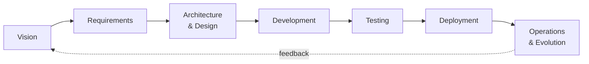

# Классический Software Development LifeCycle

<v-clicks>

- Хорошо, с цепочками ценности разобрались. А как мы обычно создаем ПО?

## Канонический набор фаз

## Популярные методологии, фреймворки, практики

- **Waterfall** - линейный, последовательный.
- **V-Model** - waterfall + параллельное тестирование.
- **Scrum** - спринты, роли, церемонии.
- **Kanban** - поток, WIP-лимиты, визуальная доска.
- **DevOps** - объединение Dev и Ops, CI/CD.

</v-clicks>

<!--
Notes
-->
