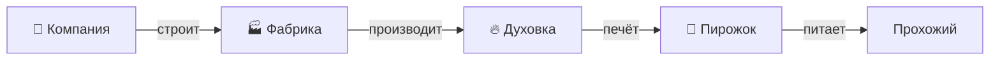

# Применяем SDLC

<v-clicks>

Давайте **применим SDLC** к цепочке создания ценности.

</v-clicks>

<v-clicks>

Но **к чему** именно применяется **SDLC**?
- К **целевой** системе?
- А может, к **подсистеме**?
- К **системе в окружении**?
- К **надсистеме**?
- К **системе создания**?

</v-clicks>

<!--
Notes
-->
