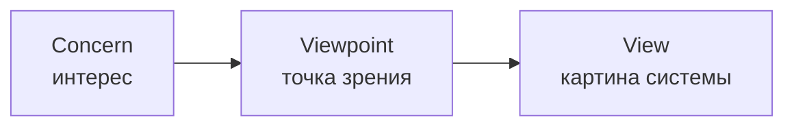

# Concern - Viewpoint - View

<v-clicks>

## Разные интересы

</v-clicks>

<v-clicks>

- **Разработчик** заинтересован в развитии системы создания (и **себя** в первую очередь!)
- **Бизнесмен** заинтересован в развитии **продукта**

</v-clicks>

<v-clicks>

## Разные роли

</v-clicks>

<v-clicks>

- Вася **в роли** разработчика работает **по методу** кодирования на C#
- Петя **в роли** предпринимателя-визионера работает **по методу** целеполагания и стратегирования

</v-clicks>

<v-clicks>

> **Интересы** (concerns) у них разные. Поэтому каждая роль смотрит на систему со своей **точки зрения** (viewpoint), а следовательно, видит свою **картину** (view).

> Разные точки зрения - разные картины системы. А значит - и разные **атрибуты качества** для каждой из них.

</v-clicks>

<!--
Notes
-->
