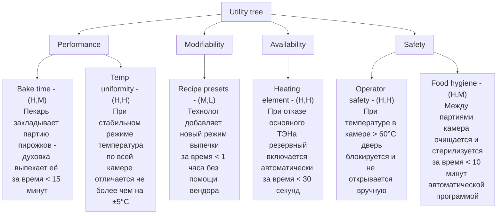

# Quality attributes (QA)

<v-clicks>

Атрибуты качества - измеримые свойства системы. 

Пример utility tree для целевой системы **промышленная духовка**:

```mermaid {themeVariables: {fontSize: '28px'}}
%%{init: {'themeVariables': {'fontSize': '28px'}}}%%
graph TD
    U[Utility tree] --> P[Performance]
    U --> M[Modifiability]
    U --> A[Availability]
    U --> S[Safety]

    P --> P1["Bake time - (H,M)<br/>Пекарь закладывает партию пирожков -<br/>духовка выпекает её за время < 15 минут"]
    P --> P2["Temp uniformity - (H,H)<br/>При стабильном режиме температура<br/>по всей камере отличается не более чем на ±5°C"]

    M --> M2["Recipe presets - (M,L)<br/>Технолог добавляет новый режим выпечки<br/>за время < 1 часа без помощи вендора"]

    A --> A1["Heating element - (H,H)<br/>При отказе основного ТЭНа резервный<br/>включается автоматически за время < 30 секунд"]

    S --> S1["Operator safety - (H,H)<br/>При температуре в камере > 60°C дверь<br/>блокируется и не открывается вручную"]
    S --> S2["Food hygiene - (H,M)<br/>Между партиями камера очищается и стерилизуется<br/>за время < 10 минут автоматической программой"]
```

</v-clicks>

<!--
Notes
-->
