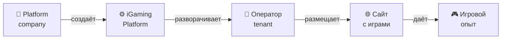

# Цепочка создания ценности: iGaming

<v-clicks>

Теперь применим все это к реальному кейсу из IT. 

Вот цепочка создания ценности iGaming:

> Компания владеет и развивает платформу. Оператор разворачивает на платформе свой tenant, создает iGaming-сайт и продает доступ к играм пользователям. Оператор платит компании за эту возможность.

</v-clicks>

<!--
подытожить про пирожки
-->
