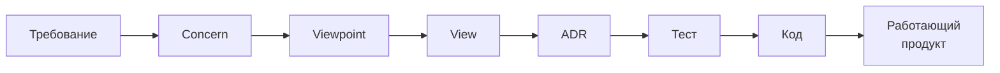

# Прослеживаемость

<v-clicks>

Разберем Traceability подробнее. 

**Traceability** - это податрибут более общего атрибута качества **Auditability** - способности в любой момент ответить: "**почему мы приняли это решение**?"

Почему это **критично**, когда агенты - **люди**? 

> Потому что чем **больше стейкхолдеров**, тем важнее сохранять и **передавать контекст** на всех этапах.

</v-clicks>

<!--
Notes
-->
