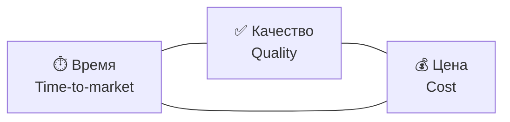

# Последствия AI-driven SDLC

<v-clicks>

Зачем вообще внедрять AI в SDLC? 

Ответ кроется в атрибутах качества - прежде всего **Time-to-market**.

Но если AI строит системы - то как его **проверять**? 

Так же, как проверяем людей:

</v-clicks>

<v-clicks>

- детерминированные тесты, линтеры
- валидация и ревью другими агентами (людьми или AI)

</v-clicks>

<!--
Notes
-->
